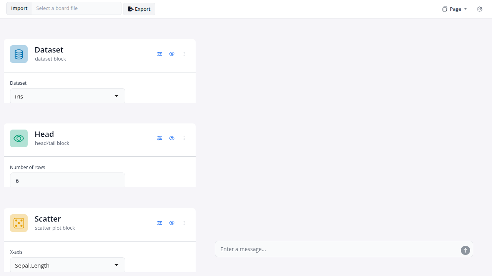

<!-- README.md is generated from README.Rmd. Please edit that file -->

# blockr.assistant

<!-- badges: start -->

[](https://lifecycle.r-lib.org/articles/stages.html#experimental)
[](https://github.com/BristolMyersSquibb/blockr.assistant/actions/workflows/ci.yaml)
[](https://app.codecov.io/gh/BristolMyersSquibb/blockr.assistant)
<!-- badges: end -->

An [`ellmer`](https://ellmer.tidyverse.org/)-powered chat panel for
[`blockr.dock`](https://github.com/BristolMyersSquibb/blockr.dock)
boards. The assistant ships as a `dock_extension` that slots into the
board layout like any other panel; the chat UI is built on
[`shinychat`](https://github.com/posit-dev/shinychat).

## Installation

You can install the development version of blockr.assistant from
[GitHub](https://github.com/) with:

``` r
# install.packages("pak")
pak::pak("BristolMyersSquibb/blockr.assistant")
```

## Example

Mount the assistant on a small board. The chat is wired to whichever
`ellmer` model the board’s `llm_model` option resolves to (by default
`ellmer::chat_openai()`); set the `blockr.chat_function` option to swap
providers.

``` r
# A small pipeline wired up before the assistant mounts, so it has
# something to navigate to (not just from). Try:
#
# - "What is on the board?" -- the answer should come from the prompt's
#   Board section, no tool call required.
# - "What is the unique value of `Species` in the data block?" -- the
#   model should call `inspect_results(code = "unique(data$Species)")`.
# - "Add a scatter plot of Sepal.Length vs Petal.Length grouped by
#   Species" -- the model stages add_block (and add_link) calls; flush
#   happens at turn end.
# - "Rename `head` to `top_rows`" -- the model declines the in-place
#   rename and offers remove + add, triggered by the id-immutability
#   paragraph in the default prompt's intro (no tool call needed).

library(blockr.core)
library(blockr.dock)
library(blockr.assistant)

board <- new_dock_board(
  blocks = c(
    data = new_dataset_block("iris"),
    filt = new_subset_block(subset = "Sepal.Length > 5"),
    head = new_head_block(n = 10L),
    plot = new_scatter_block(x = "Sepal.Length", y = "Sepal.Width")
  ),
  links = c(
    new_link("data", "filt", "data"),
    new_link("filt", "head", "data"),
    new_link("filt", "plot", "data")
  ),
  stacks = c(
    prep    = new_stack(c("data", "filt"), name = "Prep"),
    display = new_stack(c("head", "plot"), name = "Display")
  ),
  extensions = list(assistant = new_assistant_extension()),
  layout = list(
    list("data", "filt", "head", "plot"),
    "assistant"
  )
)

serve(board)
```

<figure>

<figcaption aria-hidden="true">Assistant panel mounted next to a small
<code>blockr.dock</code> board.</figcaption>
</figure>

## Status

The assistant is feature-complete for the initial roadmap: read tools
(`list_blocks`, `describe_block`, `inspect_results`, …), mutation tools
(`add_block`, `modify_block`, …) flushed atomically per turn, and a
system prompt refreshed on every materialized board change so the model
always sees the current shape of the board.

See the
[roadmap](https://bristolmyerssquibb.github.io/blockr.assistant/articles/design/0-roadmap.html)
for the staged plan and the per-phase design notes for what was shipped
in each phase.

## Driving a board from outside

The chat panel is one way to reach a board's tools. The same tools are also
reachable over HTTP, so a harness that is not this package -- Claude Code, an
agent SDK, a chat application running beside the app -- can drive a board the
way the panel does.

Three pieces, all in this package:

- **`agent_toolkit()`** is the half of the chat extension that is not about
  being a chat: the tools, the staging payload, and the `commit` that flushes
  it and answers with the board's re-evaluation report. The panel puts a model
  in front of it; the access extension puts HTTP in front of it.
- **`new_agent_access_extension()`** publishes that per session. `GET` returns
  the tools with their schemas, the board summary and the instructions; `POST`
  runs one. Each open board also announces itself in a registry directory
  (`agent_registry_dir()`), refreshing while it lives and removing itself when
  it ends, because nothing outside an app can enumerate its Shiny sessions.
- **`inst/facade/server.py`** is a stateless Streamable HTTP MCP server. It
  reads the registry, so one open board needs no configuration at all; with
  several, `list_boards` names them and every tool takes a `board` argument.

Local run:

```sh
Rscript dev/run-app.R > /tmp/app.log 2>&1 &   # open the printed URL
PORT=8765 dev/facade.sh
```

```json
{"mcpServers": {"blockr": {"type": "http", "url": "http://127.0.0.1:8765/mcp"}}}
```

Nothing in that config names a board. The agent calls `list_boards` and picks.

Behind a server that runs the app as several R processes, the same code needs
two things: the registry pointed at storage every process can read, and the
stickiness cookie recorded in the entry, so a call lands in the process holding
the board rather than a sibling.

Which cookie that is depends on what sits in front of the app.
`agent_affinity_cookies()` defaults to the names AWS and Azure fix; nginx,
HAProxy and Traefik let the operator choose one, so there is nothing to
default and `blockr.agent_affinity_cookies` has to be set. When nothing is
recognised the Agent panel lists the cookie names the browser did send, which
is where the right one will be.

Only the named cookies travel. A stickiness cookie is a routing token with no
identity in it; the rest of a browser's header is the user's session with the
server, and does not belong in an agent's config.
